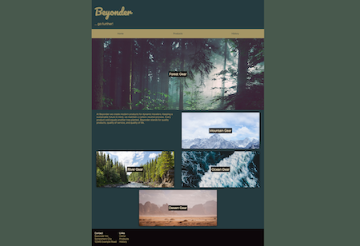

# Responsive Website

This challenges revolves around making a website responsive via media queries and breakpoints.

Make sure to take a good look at the preview screens.

## Task

- familiarize yourself with the `./index.html` and `./css/styles.css` files
- find out how many breakpoints you need to implement
- find out what needs to change to meet the visual guidelines established in the preview screens
- ... enjoy!

---

#### Hint ✨

_Several hints can be found in `./css/styles.css` file._

Here are some preview screens that (hopefully) help you get an idea of what needs to be done.

> 💡 Hint: You will only need to create media queries for two breakpoints.

### Mobile Screens

 

### Tablet Screen

### Desktop Screen

